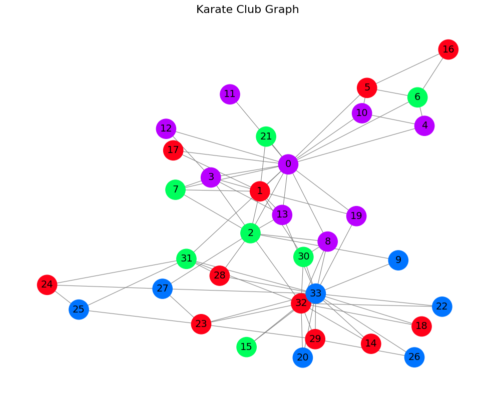
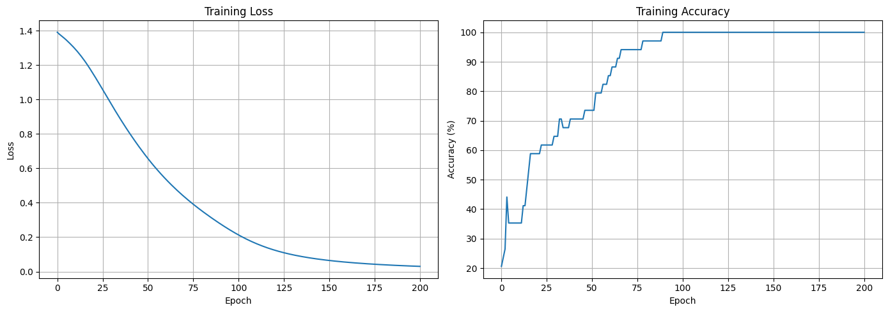
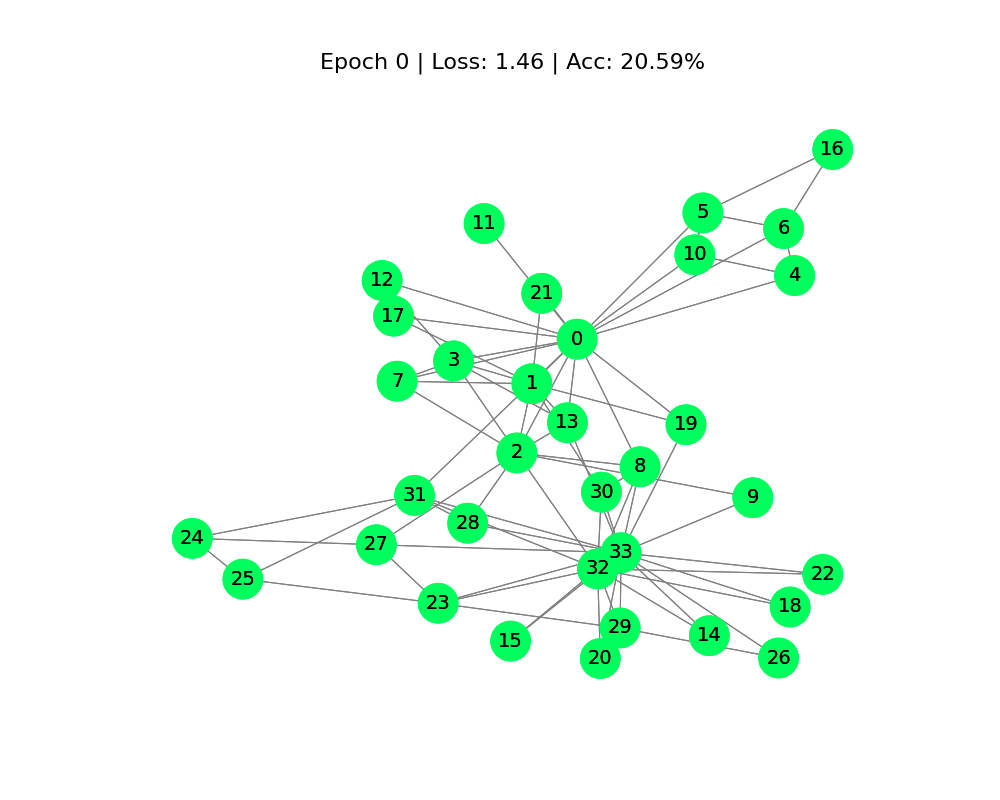
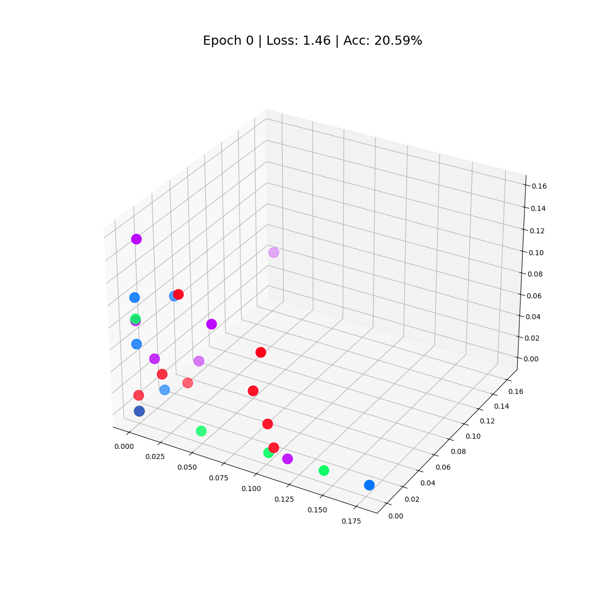

# GCN — Karate Club Node Classification

A Graph Convolutional Network (GCN) built with PyTorch Geometric to classify nodes in the classic Karate Club social network dataset.

[](https://nbviewer.org/github/YOUR_USERNAME/gnn-node-classification/blob/main/gcn-karate-club-node-classification.ipynb)
[](https://www.python.org/)
[](https://pytorch.org/)
[](https://pyg.org/)

---

## Overview

The [Karate Club dataset](https://en.wikipedia.org/wiki/Zachary%27s_karate_club) represents a real social network of 34 people in a university karate club. The task is to predict which of 4 communities each person belongs to, using only the graph structure and node features — no labels during training.

| Property | Value |
|---|---|
| Nodes | 34 |
| Edges | 156 |
| Classes | 4 |
| Task | Node Classification |

---

## Graph Structure

Each node is a person; edges represent friendships. Node 0 (instructor) and Node 33 (club president) are the two most connected nodes and act as community anchors.



---

## Model Architecture

```
GCN(
  (gcn): GCNConv(34 → 3)     # aggregate neighbor features
  (out): Linear(3 → 4)        # classify into 4 communities
)
```

The GCN layer learns a 3-dimensional embedding per node by aggregating information from neighboring nodes. The linear layer maps these embeddings to class scores.

**Loss:** CrossEntropyLoss  
**Optimizer:** Adam  
**Epochs:** 200

---

## Training Results

The model converges smoothly — loss drops from ~1.4 to near 0, and accuracy reaches **100%** by epoch ~80.



---

## Animations

### Node Classification — Learning Process
Watch how the model learns to separate 4 communities over 200 epochs.



### 3D Node Embeddings
After training, each node is projected into 3D space — nodes from the same community cluster together.



---

## Notebook Contents

| Section | Description |
|---|---|
| 1. Imports | PyTorch, PyG, NetworkX, Matplotlib |
| 2. Load Dataset | KarateClub from PyG |
| 3. Assign Labels | 4 community labels |
| 4. Visualize Graph | Color-coded community graph |
| 5. Model Architecture | 2-layer GCN definition |
| 6. Training Loop | 200 epochs with loss & accuracy tracking |
| 7. Training Curves | Loss and accuracy plots |
| 8. Graph Animation | Node classification evolving over epochs |
| 9. 3D Embeddings | Final node embeddings in 3D space |

---

## Installation

```bash
pip install torch torch_geometric optuna
```

---

## Usage

```bash
git clone https://github.com/YOUR_USERNAME/gnn-node-classification.git
cd gnn-node-classification
jupyter notebook gcn-karate-club-node-classification.ipynb
```
